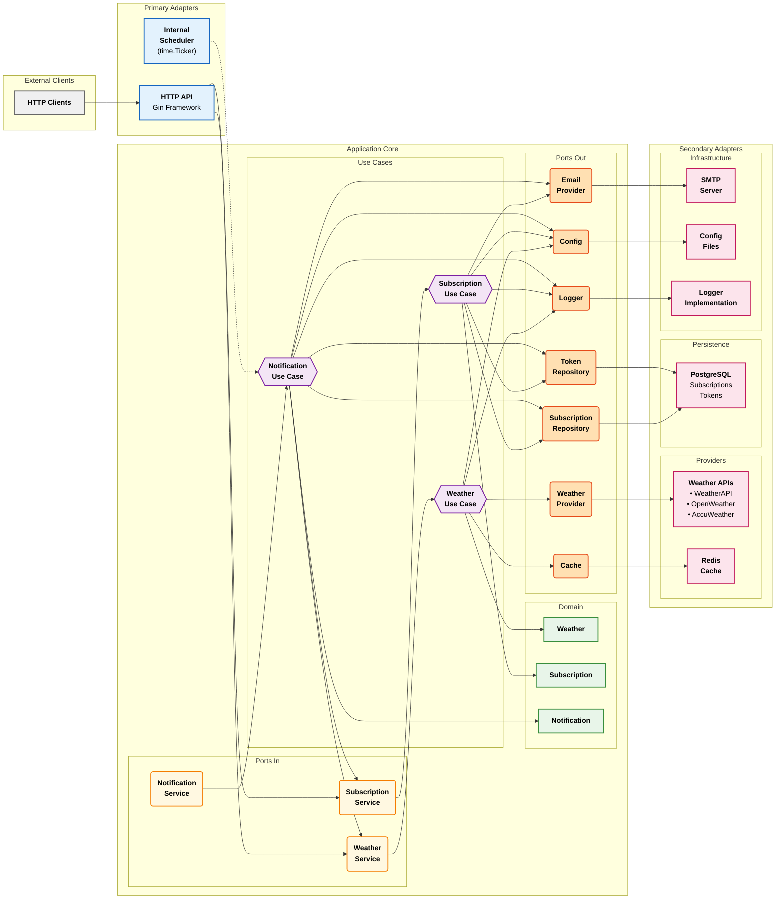

# Architecture

```mermaid
graph LR
    subgraph "External Clients"
        Client["`**HTTP Clients**`"]
    end
    
    subgraph "Primary Adapters"
        HTTP["`**HTTP API**
        Gin Framework`"]
        AppScheduler["`**Internal
        Scheduler**
        (time.Ticker)`"]
    end
    
    subgraph "Application Core"
        subgraph "Ports In"
            IWP("`**Weather
            Service**`")
            ISP("`**Subscription
            Service**`")
            INP("`**Notification
            Service**`")
        end
        
        subgraph "Use Cases"
            WUC{{"`**Weather
            Use Case**`"}}
            SUC{{"`**Subscription
            Use Case**`"}}
            NUC{{"`**Notification
            Use Case**`"}}
        end
        
        subgraph "Domain"
            WE["`**Weather**`"]
            SE["`**Subscription**`"]
            NE["`**Notification**`"]
        end
        
        subgraph "Ports Out"
            OWP("`**Weather
            Provider**`")
            OCP("`**Cache**`")
            OSR("`**Subscription
            Repository**`")
            OTR("`**Token
            Repository**`")
            OEP("`**Email
            Provider**`")
            OLP("`**Logger**`")
            OCF("`**Config**`")
        end
    end
    
    subgraph "Secondary Adapters"
        subgraph "Providers"
            WAPI["`**Weather APIs**
            • WeatherAPI
            • OpenWeather
            • AccuWeather`"]
            REDIS["`**Redis
            Cache**`"]
        end
        
        subgraph "Persistence"
            PG["`**PostgreSQL**
            Subscriptions
            Tokens`"]
        end
        
        subgraph "Infrastructure"
            EMAIL["`**SMTP
            Server**`"]
            CONFIG["`**Config
            Files**`"]
            LOG["`**Logger
            Implementation**`"]
        end
    end
    
    %% External to Primary
    Client --> HTTP
    
    %% Primary to Ports In
    HTTP --> IWP
    HTTP --> ISP
    AppScheduler -.-> NUC
    
    %% Ports In to Use Cases
    IWP --> WUC
    ISP --> SUC
    INP --> NUC
    
    %% Use Cases to Domain
    WUC --> WE
    SUC --> SE
    NUC --> NE
    
    %% Use Cases to Ports Out (Weather)
    WUC --> OWP
    WUC --> OCP
    WUC --> OLP
    WUC --> OCF
    
    %% Use Cases to Ports Out (Subscription)
    SUC --> OSR
    SUC --> OTR
    SUC --> OEP
    SUC --> OLP
    SUC --> OCF
    
    %% Use Cases to Ports Out (Notification)
    NUC --> OEP
    NUC --> OLP
    NUC --> OCF
    NUC --> OTR
    NUC --> OSR
    
    %% Cross-context dependencies
    NUC --> IWP
    NUC --> ISP
    
    %% Ports Out to Secondary
    OWP --> WAPI
    OCP --> REDIS
    OSR --> PG
    OTR --> PG
    OEP --> EMAIL
    OCF --> CONFIG
    OLP --> LOG
    
    %% Styling
    classDef client fill:#f0f0f0,stroke:#666,stroke-width:2px,color:#000
    classDef driving fill:#e3f2fd,stroke:#1565c0,stroke-width:2px,color:#000
    classDef portIn fill:#fff8e1,stroke:#f57c00,stroke-width:2px,color:#000
    classDef usecase fill:#f3e5f5,stroke:#7b1fa2,stroke-width:2px,color:#000
    classDef entity fill:#e8f5e9,stroke:#388e3c,stroke-width:2px,color:#000
    classDef portOut fill:#ffe0b2,stroke:#e64a19,stroke-width:2px,color:#000
    classDef driven fill:#fce4ec,stroke:#c2185b,stroke-width:2px,color:#000
    classDef invisible fill:transparent,stroke:transparent
    
    class Client client
    class Placeholder invisible
    class HTTP,AppScheduler driving
    class IWP,ISP,INP portIn
    class WUC,SUC,NUC usecase
    class WE,SE,NE entity
    class OWP,OCP,OSR,OTR,OEP,OLP,OCF portOut
    class WAPI,REDIS,PG,EMAIL,CONFIG,LOG driven
```
