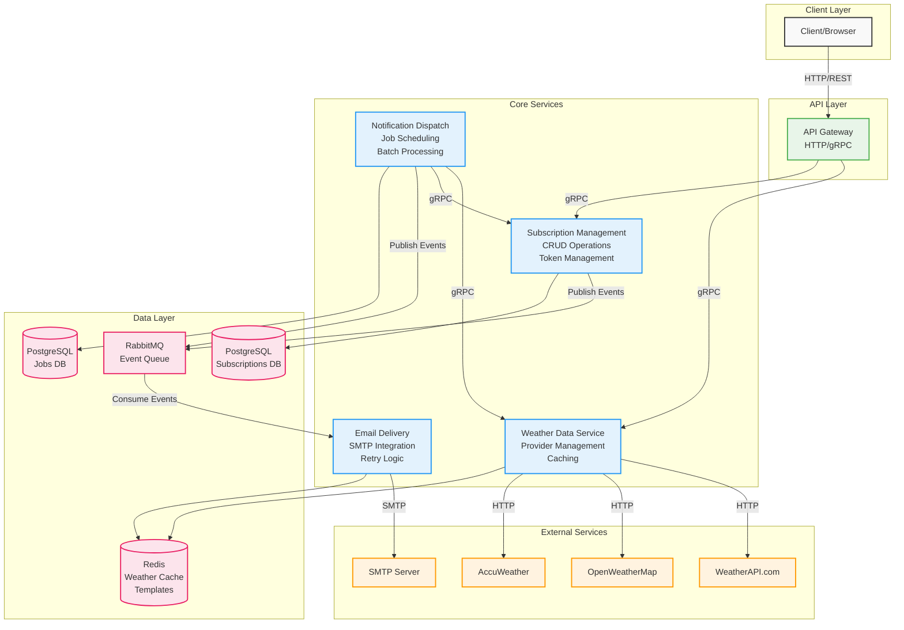

# Microservice Migration Architecture

## Current State Analysis

The weather forecast API currently operates as a monolithic application with the following components:
- HTTP API handlers (Gin framework)
- Weather data fetching with provider failover
- Subscription management with email confirmation
- Scheduled notification delivery
- Caching layer (Redis/Memory)
- Database persistence (PostgreSQL)

The application follows hexagonal architecture with clear domain boundaries, making it suitable for microservice extraction.

## Proposed Microservice Architecture

### Service Decomposition

#### 1. API Gateway Service
**Purpose**: Single entry point for external HTTP requests

**Responsibilities**:
- HTTP request routing to internal services
- Request/response transformation between HTTP and gRPC
- Rate limiting and authentication
- API documentation serving

**Justification**: Separates external API concerns from business logic, enables independent scaling of API layer

#### 2. Weather Data Service
**Purpose**: Weather information retrieval and caching

**Responsibilities**:
- Integration with external weather providers (WeatherAPI, OpenWeatherMap, AccuWeather)
- Provider failover management
- Response caching with configurable TTL
- Weather data transformation

**Justification**: Isolates external dependencies, enables independent caching strategies and provider management

#### 3. Subscription Management Service
**Purpose**: User subscription lifecycle management

**Responsibilities**:
- Subscription CRUD operations
- Token generation for confirmation/unsubscribe
- Subscription state management
- Database persistence

**Justification**: Core business domain requiring independent development and scaling

#### 4. Notification Dispatch Service
**Purpose**: Notification scheduling and coordination

**Responsibilities**:
- Scheduled job execution (hourly/daily)
- Subscription aggregation for batch processing
- Notification event publishing
- Job state persistence and recovery

**Justification**: Separates scheduling concerns from delivery, enables different scaling patterns

#### 5. Email Delivery Service
**Purpose**: Email composition and delivery

**Responsibilities**:
- Email template rendering
- SMTP integration
- Delivery retry logic
- Bounce handling

**Justification**: Isolates email infrastructure, allows for future notification channel expansion

## System Architecture Overview

## Communication Patterns

### Protocol Selection Matrix

| Source Service | Target Service | Protocol | Justification |
|----------------|----------------|----------|---------------|
| API Gateway | Weather Data | gRPC | Low latency requirement, type safety |
| API Gateway | Subscription Management | gRPC | CRUD operations, type safety |
| Subscription Management | Notification Dispatch | RabbitMQ | Asynchronous event processing |
| Notification Dispatch | Weather Data | gRPC | Synchronous data retrieval |
| Notification Dispatch | Subscription Management | gRPC | Bulk data retrieval |
| Notification Dispatch | Email Delivery | RabbitMQ | Asynchronous processing, retry handling |
| External Clients | API Gateway | HTTP/REST | Browser compatibility, industry standard |

### Communication Flow Examples

#### Subscription Creation Flow
1. Client sends HTTP POST to API Gateway
2. API Gateway makes gRPC call to Subscription Management
3. Subscription Management stores data in PostgreSQL
4. Subscription Management publishes event to RabbitMQ
5. Email Delivery consumes event and sends confirmation email

#### Weather Update Flow
1. Notification Dispatch triggered by scheduler
2. gRPC call to Subscription Management for active subscriptions
3. For each subscription, gRPC call to Weather Data
4. Publish batch events to RabbitMQ
5. Email Delivery processes events asynchronously

## Data Management

### Storage Allocation

| Service | Primary Storage | Cache Layer | Purpose |
|---------|----------------|-------------|----------|
| Subscription Management | PostgreSQL | - | Subscription persistence |
| Weather Data | - | Redis | API response caching |
| Notification Dispatch | PostgreSQL | - | Job state persistence |
| Email Delivery | - | Redis | Template caching |

**Database Isolation**: Each service maintains its own dedicated database instance. Subscription Management and Notification Dispatch use separate PostgreSQL databases to ensure service independence and prevent schema coupling. Services communicate through APIs only, never through shared database access.

### Caching Strategy

**Weather Data Cache**:
- TTL: 10 minutes (configurable)
- Key pattern: `weather:{city}:{provider}`
- Invalidation: Time-based expiry only

**Email Template Cache**:
- TTL: 1 hour
- Key pattern: `template:{type}:{version}`
- Invalidation: Manual on template update

## Implementation Considerations

### Performance Evaluation Criteria

For gRPC vs HTTP/REST comparison:
1. **Latency**: P50, P95, P99 response times under load
2. **Throughput**: Requests per second at sustainable load
3. **Resource utilization**: CPU and memory consumption
4. **Development velocity**: Time to implement new endpoints
5. **Debugging complexity**: Time to diagnose issues

### Failure Handling Strategies

**Weather Provider Failures**:
- Circuit breaker pattern with 30-second timeout
- Automatic failover to next provider
- Fallback to cached data if available

**Email Delivery Failures**:
- Exponential backoff: 1min, 5min, 30min, 2hr
- Maximum 5 retry attempts
- Dead letter queue for manual intervention

**Scheduler Restarts**:
- Job state persisted to PostgreSQL
- On restart, resume from last checkpoint
- Duplicate detection using idempotency keys

### Observability Architecture

**Metrics Collection**:
- Each service exposes Prometheus metrics endpoint
- Centralized Prometheus server for aggregation
- Service-specific dashboards in Grafana

**Distributed Tracing**:
- OpenTelemetry integration in all services
- Trace context propagation via gRPC metadata
- Jaeger for trace storage and visualization

**Logging**:
- Structured logging with correlation IDs
- Centralized log aggregation (ELK stack)
- Log levels: ERROR, WARN, INFO, DEBUG

## Migration Strategy

### Phase 1: Infrastructure Preparation
1. Deploy message queue (RabbitMQ)
2. Set up service discovery mechanism
3. Configure monitoring infrastructure

### Phase 2: Email Delivery Extraction
1. Extract email functionality to separate service
2. Implement RabbitMQ integration
3. Parallel run with monolith for validation

### Phase 3: Weather Data Service
1. Extract weather provider logic
2. Implement caching layer
3. Update monolith to use new service

### Phase 4: Core Services
1. Extract Subscription Management
2. Extract Notification Dispatch
3. Implement inter-service communication

### Phase 5: API Gateway
1. Deploy API Gateway
2. Route traffic gradually (canary deployment)
3. Decommission monolith endpoints

### Rollback Strategy
Each phase maintains backward compatibility. Services can be disabled via feature flags, routing traffic back to monolith components.

## Security Considerations

**Inter-service Communication**:
- mTLS for gRPC connections
- Service-to-service authentication via certificates
- Network isolation using Kubernetes namespaces

**API Gateway Security**:
- Rate limiting per client
- API key validation
- CORS configuration for web clients

## Capacity Planning

**Service Replicas** (Initial):
- API Gateway: 3 replicas
- Weather Data: 2 replicas
- Subscription Management: 2 replicas
- Notification Dispatch: 1 replica
- Email Delivery: 3 replicas