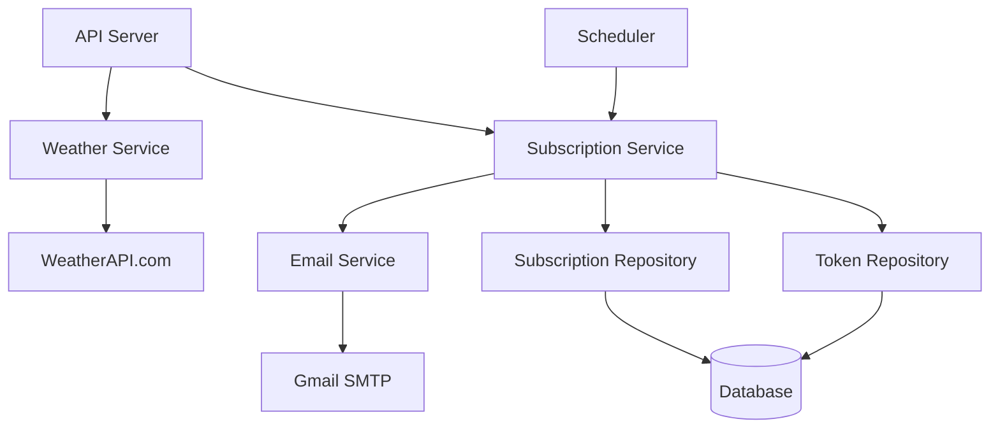
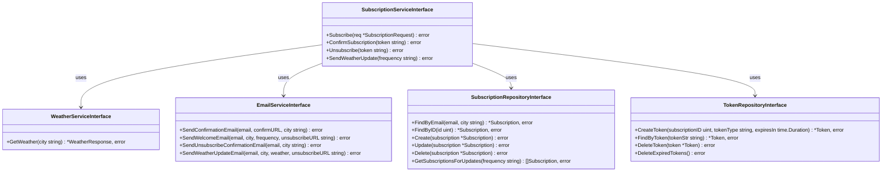
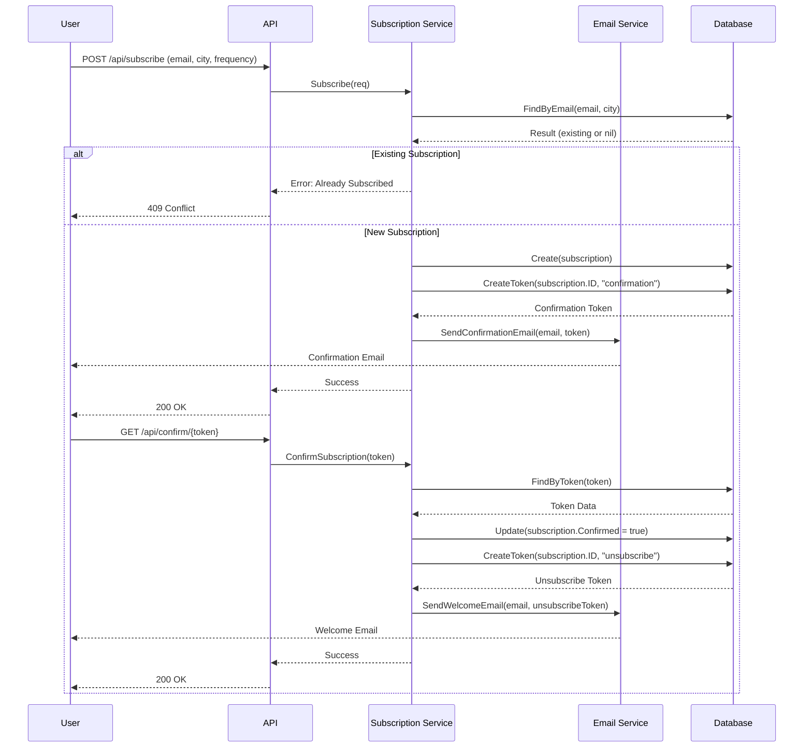
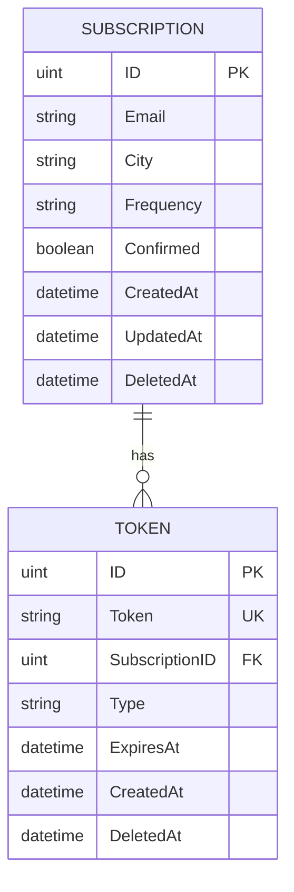

# Weather Forecast API: System Design

## Requirements and Constraints

**Functional Requirements:**
- Allow users to subscribe to weather updates for specific cities
- Support different update frequencies (hourly, daily)
- Deliver weather updates via email
- Enable subscription confirmation via email
- Provide a way to unsubscribe from updates
- Display current weather information on demand

**Non-Functional Requirements:**
- High delivery reliability for emails
- Responsive API (< 500ms response time)
- Support for multiple concurrent users
- Secure handling of user email addresses
- Cost-effective implementation

**Constraints:**
- Limited to 1,000 API calls per day on WeatherAPI.com
- Email delivery limits (2,000 emails per day via Gmail SMTP)
- PostgreSQL database capacity

### Business Justification
This service addresses the user need for timely weather information without manual effort. It demonstrates the ability to create a subscription-based notification system that could be applied to various other information types beyond weather.

## Solution

### Product

**Use Case Scenarios:**
1. **Weather Lookup:** User queries current weather for a specific city
   - Input: City name
   - Output: Current temperature, humidity, and weather description

2. **Weather Subscription:** User subscribes to regular weather updates
   - Input: Email address, city name, frequency preference
   - Process: System sends confirmation email with verification link
   - Output: Confirmation message to user

3. **Subscription Confirmation:** User confirms subscription
   - Input: Confirmation token (via URL)
   - Process: System verifies token and activates subscription
   - Output: Welcome message and subscription details

4. **Weather Update Delivery:** System sends weather updates
   - Process: At scheduled intervals, system fetches weather data and sends emails
   - Output: Weather update email to subscribers

5. **Unsubscribe:** User cancels subscription
   - Input: Unsubscribe token (via URL)
   - Process: System verifies token and removes subscription
   - Output: Unsubscribe confirmation message

### Integration

**WeatherAPI.com Integration:**
- RESTful API calls to fetch current weather data
- Endpoint: `https://api.weatherapi.com/v1/current.json`
- Parameters: API key, city name
- Response: JSON with weather data

**Email Service Integration:**
- Gmail SMTP for email delivery
- Authentication via app passwords
- TLS encryption for secure transmission

### API

**Endpoints:**
- `GET /api/weather?city={cityname}`
  - Returns current weather for specified city
  - Response: JSON with temperature, humidity, description

- `POST /api/subscribe`
  - Accepts subscription requests
  - Parameters: email, city, frequency
  - Response: Success message or error

- `GET /api/confirm/{token}`
  - Confirms subscription using verification token
  - Response: Success message or error

- `GET /api/unsubscribe/{token}`
  - Processes unsubscribe requests
  - Response: Confirmation message or error

### Services

#### System Architecture

#### Service Relationships

#### Subscription Process Flow

#### Database Model

**Database Details:**
- Uses PostgreSQL with GORM ORM
- Implements soft delete with DeletedAt fields
- One subscription can have multiple tokens (for confirmation and unsubscribe)
- Token types: "confirmation" or "unsubscribe"
- Frequency values: "hourly" or "daily"

**Estimated Load:**
- Up to 1,000 weather API calls per day
- Maximum 2,000 email deliveries per day
- Database sized for up to 10,000 subscriptions

## Review Process

### Review Checklist
- Code quality and adherence to standards
- Security of user data handling
- Performance under expected load
- Error handling and recovery
- Documentation completeness
